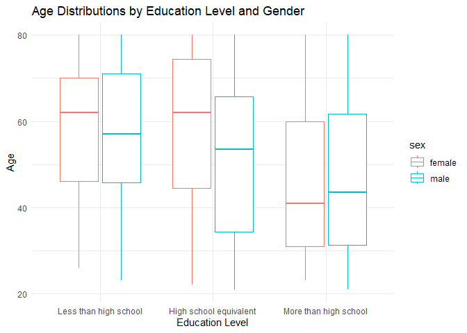

p8105_hw3_pm3260
================
Pradeeti Mainali
2024-10-08

# Question 1

``` r
library(p8105.datasets)
data("ny_noaa")
```

### Description of data set

### Data cleaning

# Question 2

``` r
# Loading, tidying, merging, and organizing the data sets:

accel_df = 
  read.csv("./data/nhanes_accel.csv") |>
  janitor::clean_names() |>
  drop_na()

covar_df = 
  read.csv("./data/nhanes_covar.csv", skip=4) |>
  janitor::clean_names() |>
  filter(age >= 21) |>
  drop_na(sex, age) |>
  mutate(
    sex = case_match(
      sex, 
      1 ~ "male",
      2 ~ "female"),
    education = case_match(
      education, 
      1 ~ "Less than high school",
      2 ~ "High school equivalent",
      3 ~ "More than high school"
    ))

activity_df = 
  left_join(
    covar_df, accel_df, by = c("seqn"))
```

#### Creating table for sex x education level

``` r
table_sxed = 
  activity_df |>
   mutate(
     education = 
       factor(education, 
              levels = c("Less than high school", "High school equivalent", "More than high school")))|>
  count(education, sex) |>
  pivot_wider(
    names_from = sex,
    values_from = n,
    values_fill = 0
  ) |>
  knitr::kable()

table_sxed
```

| education              | female | male |
|:-----------------------|-------:|-----:|
| Less than high school  |     29 |   28 |
| High school equivalent |     23 |   36 |
| More than high school  |     59 |   56 |

It looks like women and men more or less have similar education levels,
aside from the ‘high school equivalent’ row. Here, there are fewer women
than men. Additionally, while men \# increases as education level
advances, there are more women in this sample with less than hs
education than those with hs equivalent education.

#### Creating a visualization of the age distributions for men and women in each education category

``` r
activity_plot = activity_df |>
   mutate(
     education = 
       factor(education, 
              levels = c("Less than high school", "High school equivalent", "More than high school")))

ggplot(
  activity_plot, 
  aes(x = education, y = age, color = sex)) +
  geom_boxplot() + 
  labs(
     title = "Age Distributions by Education Level and Gender",
    x = "Education Level",
    y = "Age"
  ) +
  theme_minimal()
```

<!-- -->

Women: Median age for those with less than hs or hs equivalent education
seems to be similar, while those with more than hs education seems to be
much younger (smaller median age).

Men: For men, the median age decreases as the education level increases.

Comparison: For less than hs and hs equivalent education levels, men
have a smaller median age than women in those categories. For the hs
equivalent ed lvl, the spread of mens ages also seems to be much lower
than the womens ages. However, in the more than hs ed level, men have a
slightly higher median age.

# Question 3

``` r
# Importing, cleaning, and organizing the data sets
```
