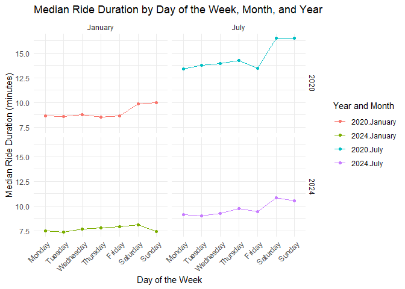

p8105_hw3_pm3260
================
Pradeeti Mainali
2024-10-08

# Question 1

``` r
library(p8105.datasets)
data("ny_noaa")
```

### Description of data set

### Data cleaning

# Question 2

``` r
# Loading, tidying, merging, and organizing the data sets:

accel_df = 
  read_csv("./data/nhanes_accel.csv") |>
  janitor::clean_names() |>
  pivot_longer(
    min1:min1440,
    names_to = "min",
    values_to = "mim") |>
  mutate(min = str_remove(min, "min"), 
         min = as.numeric(min))
```

    ## Rows: 250 Columns: 1441
    ## ── Column specification ────────────────────────────────────────────────────────
    ## Delimiter: ","
    ## dbl (1441): SEQN, min1, min2, min3, min4, min5, min6, min7, min8, min9, min1...
    ## 
    ## ℹ Use `spec()` to retrieve the full column specification for this data.
    ## ℹ Specify the column types or set `show_col_types = FALSE` to quiet this message.

``` r
covar_df = 
  read_csv("./data/nhanes_covar.csv", skip=4) |>
  janitor::clean_names() |>
  filter(age >= 21) |>
  drop_na(sex, age, education, bmi) |>
  mutate(
    sex = case_match(
      sex, 
      1 ~ "male",
      2 ~ "female"),
    education = case_match(
      education, 
      1 ~ "Less than high school",
      2 ~ "High school equivalent",
      3 ~ "More than high school"
    ))
```

    ## Rows: 250 Columns: 5
    ## ── Column specification ────────────────────────────────────────────────────────
    ## Delimiter: ","
    ## dbl (5): SEQN, sex, age, BMI, education
    ## 
    ## ℹ Use `spec()` to retrieve the full column specification for this data.
    ## ℹ Specify the column types or set `show_col_types = FALSE` to quiet this message.

``` r
activity_df = 
  left_join(
    covar_df, accel_df, by = c("seqn"))
```

#### Creating table for sex x education level

``` r
table_sxed = 
  activity_df |>
   mutate(
     education = 
       factor(education, 
              levels = c("Less than high school", "High school equivalent", "More than high school")))|>
  distinct(seqn, education, sex) |>
  count(education, sex) |>
  pivot_wider(
    names_from = sex,
    values_from = n,
    values_fill = 0
  ) |>
  knitr::kable()

table_sxed
```

| education              | female | male |
|:-----------------------|-------:|-----:|
| Less than high school  |     28 |   27 |
| High school equivalent |     23 |   35 |
| More than high school  |     59 |   56 |

It looks like women and men more or less have similar education levels,
aside from the ‘high school equivalent’ row. Here, there are fewer women
than men. Additionally, while men \# increases as education level
advances, there are more women in this sample with less than hs
education than those with hs equivalent education.

#### Creating a visualization of the age distributions for men and women in each education category

``` r
activity_plot = activity_df |>
  distinct(seqn, education, sex, age) |>
   mutate(
     education = 
       factor(education, 
              levels = c("Less than high school", "High school equivalent", "More than high school")))

ggplot(
  activity_plot, 
  aes(x = education, y = age, color = sex)) +
  geom_boxplot() + 
  labs(
     title = "Age Distributions by Education Level and Gender",
    x = "Education Level",
    y = "Age"
  ) +
  theme_minimal()
```

<!-- -->

Women: Median age for those with less than hs or hs equivalent education
seems to be similar, while those with more than hs education seems to be
much younger (smaller median age).

Men: For men, the median age decreases as the education level increases.

Comparison: For less than hs and hs equivalent education levels, men
have a smaller median age than women in those categories. For the hs
equivalent ed lvl, the spread of mens ages also seems to be much lower
than the womens ages. However, in the more than hs ed level, men have a
slightly higher median age.

#### Total activity exploration

``` r
activity_total = activity_df |>
  group_by(seqn) |>
  mutate(total_mim = sum(mim, na.rm = TRUE),
         education = 
        factor(education, 
              levels = c("Less than high school", "High school equivalent", "More than high school"))) |>
  distinct(seqn, education, total_mim, age, sex)

  ggplot(
    activity_total, 
    aes(x = age, y = total_mim, color = sex)) +
  geom_point(alpha = .5) +
  geom_smooth(se = FALSE) +
  facet_grid(. ~education) +
  labs(
    title = "Total Activity by Age",
    x = "Age (years)",
    y = "Total Activity (mim)"
  )
```

    ## `geom_smooth()` using method = 'loess' and formula = 'y ~ x'

<!-- -->

In all the three plots, as age increases, the total activity time (mim)
decreases. However, it looks like for those with less than hs education,
the decreasing trend is very steep compared to those with a more than hs
education. The trend seems to weaken as education increases.Both men and
women total activity time decreases but women on avg have higher
activity time than men (except in the second half of the plot for less
than hs education).

``` r
activity_hr = activity_df |>
  mutate(hour = ceiling(min / 60)) |>
  group_by(seqn, hour) |>
  mutate(hr_mim = sum(mim, na.rm = TRUE), 
         education = 
        factor(education, 
              levels = c("Less than high school", "High school equivalent", "More than high school"))) |>
  distinct(seqn, education, hr_mim, hour, sex)

ggplot(activity_hr, aes(x = hour, y = hr_mim, color = sex)) +
  geom_point(alpha = .1) +
  geom_smooth(se = FALSE) +
  facet_grid(. ~education) +
  labs(
    title = "24-hour activity time course by education and sex",
    x = "Time (hr)",
    y = "Activity (mim)"
  )
```

    ## `geom_smooth()` using method = 'gam' and formula = 'y ~ s(x, bs = "cs")'

<!-- -->

Looking at the graph we can see a clear ‘cyclical’ patter in all the
different education levels; the activity level is very low/decreasing
from Hr0-5 and Hr21-24 which makes sense since this correlates to around
9pm-5am ish which is when most adults are asleep. Men and women seem to
have similar patterns of activity over the different education levels
(women have slightly increased activity level than men). One difference
between the three education level is the “peaking” of activity. For
those less than hs, the activity peaks around 12-13hr and then starts
decreasing while hs equivalent and more than hs education, they peak
around 10 but then plateau for a while until 20/19hr.

# Question 3

``` r
# Importing, cleaning, and organizing the data sets
jan20_df = 
  read_csv("./data/Jan 2020 Citi.csv") |>
  janitor::clean_names() |>
  drop_na() |>
  mutate( Month = "January",
          Year = "2020")
```

    ## Rows: 12420 Columns: 7
    ## ── Column specification ────────────────────────────────────────────────────────
    ## Delimiter: ","
    ## chr (6): ride_id, rideable_type, weekdays, start_station_name, end_station_n...
    ## dbl (1): duration
    ## 
    ## ℹ Use `spec()` to retrieve the full column specification for this data.
    ## ℹ Specify the column types or set `show_col_types = FALSE` to quiet this message.

``` r
jan24_df = 
  read_csv("./data/Jan 2024 Citi.csv") |>
  janitor::clean_names() |>
  drop_na() |>
  mutate( Month = "January",
          Year = "2024")
```

    ## Rows: 18861 Columns: 7
    ## ── Column specification ────────────────────────────────────────────────────────
    ## Delimiter: ","
    ## chr (6): ride_id, rideable_type, weekdays, start_station_name, end_station_n...
    ## dbl (1): duration
    ## 
    ## ℹ Use `spec()` to retrieve the full column specification for this data.
    ## ℹ Specify the column types or set `show_col_types = FALSE` to quiet this message.

``` r
jul20_df = 
  read_csv("./data/July 2020 Citi.csv") |>
  janitor::clean_names() |>
  drop_na() |>
  mutate( Month = "July",
          Year = "2020")
```

    ## Rows: 21048 Columns: 7
    ## ── Column specification ────────────────────────────────────────────────────────
    ## Delimiter: ","
    ## chr (6): ride_id, rideable_type, weekdays, start_station_name, end_station_n...
    ## dbl (1): duration
    ## 
    ## ℹ Use `spec()` to retrieve the full column specification for this data.
    ## ℹ Specify the column types or set `show_col_types = FALSE` to quiet this message.

``` r
jul24_df = 
  read_csv("./data/July 2024 Citi.csv") |>
  janitor::clean_names() |>
  drop_na() |>
  mutate( Month = "July",
          Year = "2024")
```

    ## Rows: 47156 Columns: 7
    ## ── Column specification ────────────────────────────────────────────────────────
    ## Delimiter: ","
    ## chr (6): ride_id, rideable_type, weekdays, start_station_name, end_station_n...
    ## dbl (1): duration
    ## 
    ## ℹ Use `spec()` to retrieve the full column specification for this data.
    ## ℹ Specify the column types or set `show_col_types = FALSE` to quiet this message.

``` r
citi_df = 
  bind_rows(jan20_df, jan24_df, jul20_df, jul24_df)
```

The final data set`citi_df` has 99253 observations and 9 variables
(ride_id, rideable_type, weekdays, duration, start_station_name,
end_station_name, member_casual, Month, Year). Month and year were new
variables created to keep track of the data set the observations came
from.

#### Creating a table:

``` r
citi_table <- citi_df |>
  group_by(Year, Month, member_casual) |>
  summarize(total_rides = n(), .groups = 'drop') |>
  arrange(Year, Month) |>
  pivot_wider(
    names_from = member_casual,
    values_from = total_rides,
    values_fill = 0
  ) |>
  knitr::kable(
    caption = "Total Number of Rides by Year, Month, and Rider Type (Casual/Member)",
    col.names = c("Year", "Month",  "Casual Riders", "Member Riders"),
    align = 'c'
  )

citi_table
```

| Year |  Month  | Casual Riders | Member Riders |
|:----:|:-------:|:-------------:|:-------------:|
| 2020 | January |      980      |     11418     |
| 2020 |  July   |     5625      |     15388     |
| 2024 | January |     2094      |     16705     |
| 2024 |  July   |     10843     |     36200     |

Total Number of Rides by Year, Month, and Rider Type (Casual/Member)

Through out the years and months, it looks like the member riders are
increasing. Additionally, casual riders also increased, but there was a
decrease between jul 2020 and jan 2024. Additionally, the member riders
from jan2024 to july 2024 increased by almost 20k. I’m wondering if
there are less casual riders around Jan 2020 due to COVID.

#### Table with 5 most populat starting stations on July 2024

``` r
top_stations = citi_df |>
  filter(Year == 2024, Month == "July") |>
  group_by(start_station_name) |>
  summarize(total_rides = n(), .groups = 'drop') |>
  arrange(desc(total_rides)) |>
  slice_max(total_rides, n = 5) |>
  knitr::kable(
    caption = "Top 5 Most Popular Starting Stations for July 2024",
    col.names = c("Starting Station", "Number of Rides"),
    align = 'c'
  )

top_stations
```

|     Starting Station     | Number of Rides |
|:------------------------:|:---------------:|
| Pier 61 at Chelsea Piers |       163       |
| University Pl & E 14 St  |       155       |
|     W 21 St & 6 Ave      |       152       |
|  West St & Chambers St   |       150       |
|     W 31 St & 7 Ave      |       145       |

Top 5 Most Popular Starting Stations for July 2024
